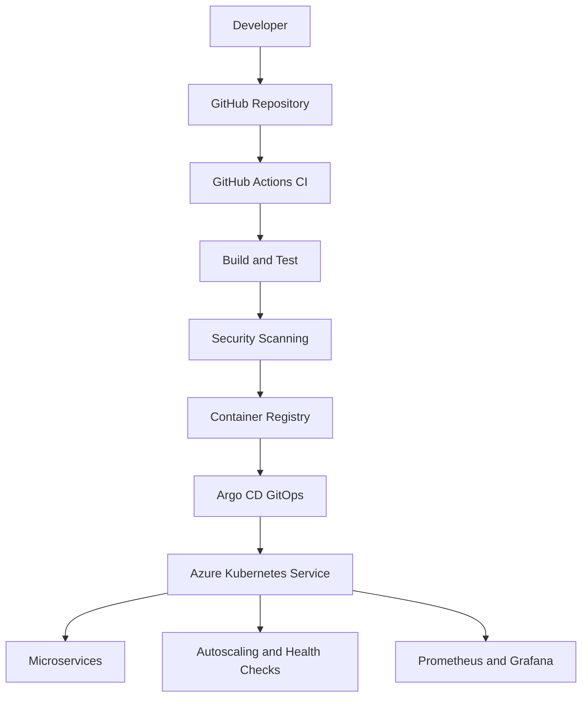

# AegisOps Architecture Diagram

```mermaid
flowchart TD
    DEV[Developer] --> GH[GitHub Repository]
    GH --> CI[GitHub Actions CI]
    CI --> BUILD[Build and Test]
    BUILD --> SCAN[Security Scanning]
    SCAN --> REG[Container Registry]
    REG --> GITOPS[Argo CD GitOps]
    GITOPS --> AKS[Azure Kubernetes Service]
    AKS --> MS[Microservices]
    AKS --> HPA[Autoscaling and Health Checks]
    AKS --> OBS[Prometheus and Grafana]
```

> **Status:** Target architecture; components must be verified before being marked implemented.
